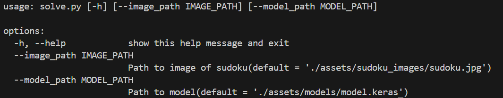
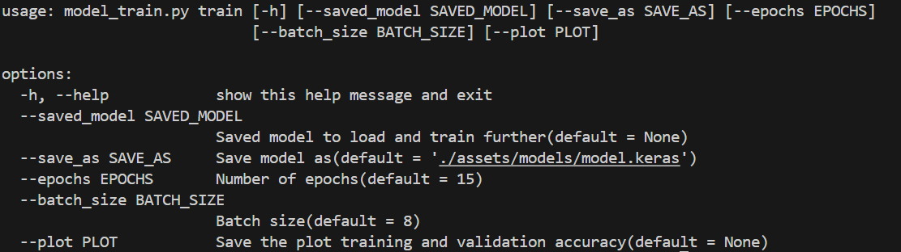
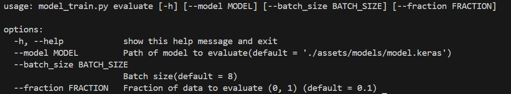
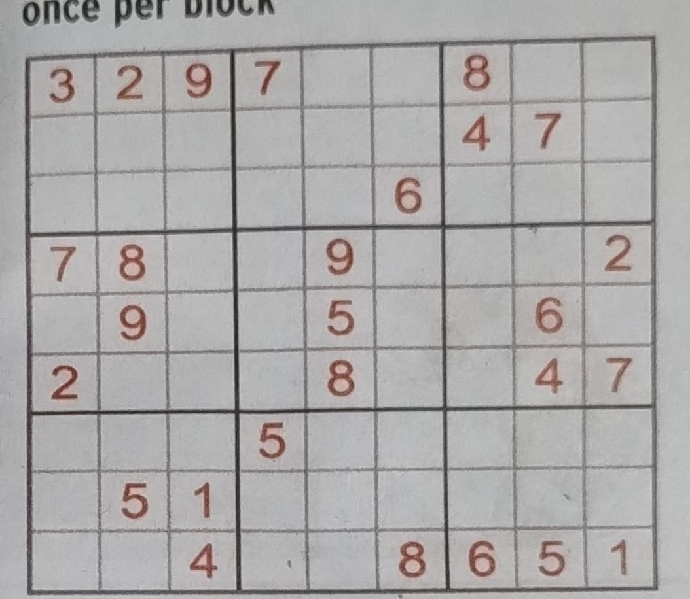
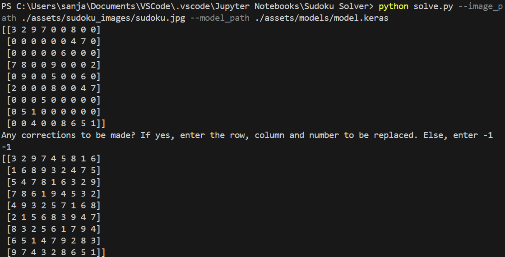

# Vision Based Sudoku Solver

## Important stages in the project
- Preprocessing the image to get only the sudoku in the image, so that 81 cells can be extracted easily
- Predicting the digits in each cell using machine learning
- Solving the sudoku using backtracking

## Dataset used for training tensorflow based CNN model
[Kaggle Dataset](https://www.kaggle.com/datasets/kshitijdhama/printed-digits-dataset/data) which boosted the accuracy to great extent and is much more useful than MNIST in this case

## Guide to run
- For solving sudoku: ```python solve.py```


- For training model: ```python model_train.py train```


- For evaluating model: ```python model_train.py evaluate```


## Model Summary


## Example of a run

- Command: `python solve.py --image_path ./assets/sudoku_images/sudoku.jpg --model_path ./assets/models/model.keras`
- Sudoku image:

- Terminal result:

