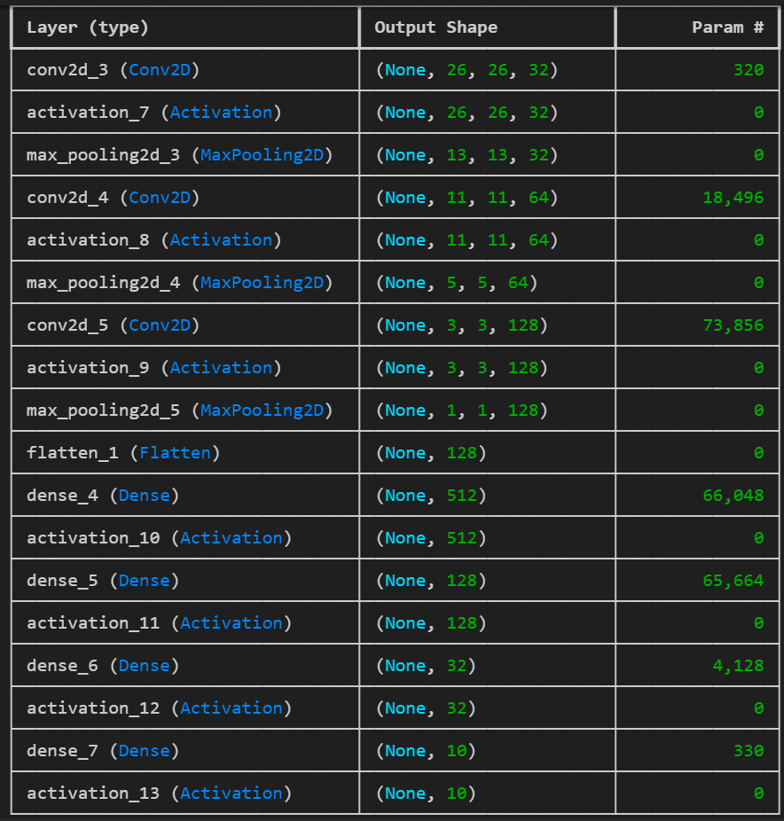

# Vision Based Sudoku Solver

## Important stages in the project
- Preprocessing the image to get only the sudoku in the image, so that 81 cells can be extracted easily
- Predicting the digits in each cell using machine learning
- Solving the sudoku using backtracking

## Dataset used for training tensorflow based CNN model
[Kaggle Dataset](https://www.kaggle.com/datasets/kshitijdhama/printed-digits-dataset/data) which boosted the accuracy to great extent and is much more useful than MNIST in this case

## Overview/flow
- `solve.py` is the main interface which solves the sudoku. It takes in two optional arguments `model_path` and `image_path` (path to the unsolved sudoku). It asks the user if they wish to make changes and persists them to make changes until its a vaild sudoku
- `model_train.py` is used for training and evaluating a certain model. For training one can specify the path to a already trained model to tune it further using `saved_model`, path to save the current model `save_as` (default = `./assets/models/model.keras`), batch size using `batch_size` (default = 8), epochs using `epochs` (default = 15) , plot path if the user wishes to save the performace history while training the model using `plot` and providing the file path (default = None). For evaluate, one can specifiy the model path using `model`, batch size using `batch_size` (default = 8), validation split (should be between 0 and 1) using `fraction` (default = 0.1)
- `make_predictions.py` does all the image processing and prediction. Model summary as follows:

- `load_data.py` is the data loader for the model